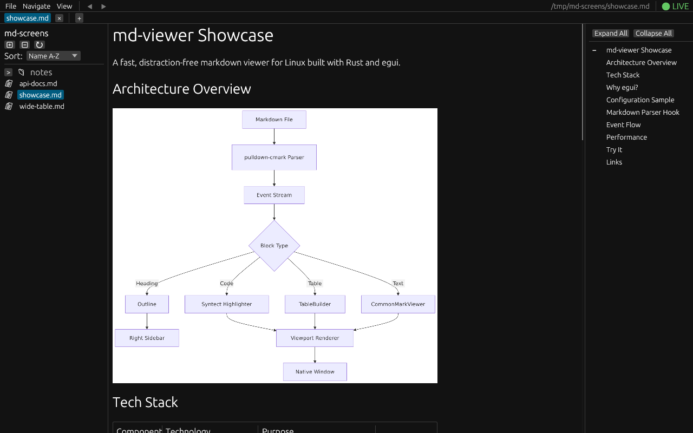
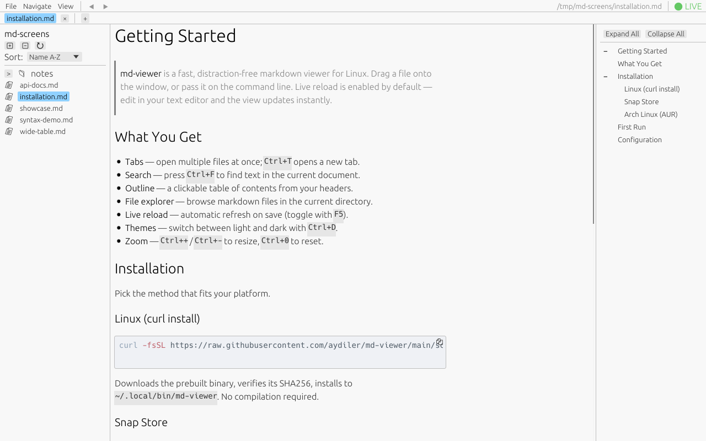
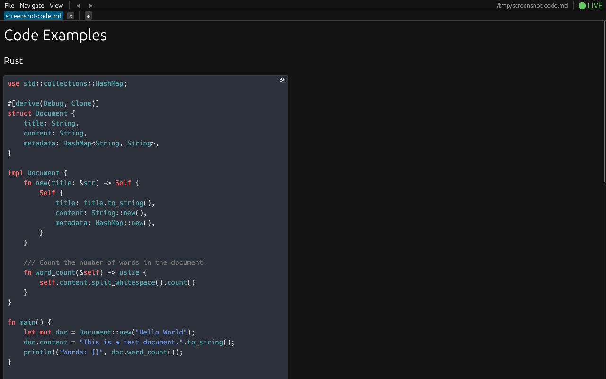

# md-viewer

[](https://crates.io/crates/md-viewer)
[](https://aur.archlinux.org/packages/md-viewer-git)
[](https://opensource.org/licenses/MIT)
[](https://github.com/aydiler/md-viewer/stargazers)

A fast, lightweight markdown viewer for Linux built with Rust and egui. Designed for distraction-free reading with excellent typography and syntax highlighting.



## Features

### Rendering
- **GitHub Flavored Markdown** - Full GFM support including tables, task lists, and footnotes
- **Syntax Highlighting** - 200+ languages via syntect with beautiful color schemes
- **Images & SVG** - Embedded image support (PNG, JPEG, GIF, SVG)
- **60 FPS Rendering** - Smooth scrolling with viewport-based lazy rendering
- **Typography** - 1.5x line height for optimal readability (WCAG 2.1 compliant)

### Navigation
- **Tab System** - Open multiple documents with tab bar (Ctrl+Click links to open in new tab)
- **File Explorer** - Hierarchical sidebar showing markdown files in the directory
- **Outline Sidebar** - Click-to-navigate table of contents from document headers
- **Per-Tab History** - Back/forward navigation within each tab (Alt+Left/Right)
- **Internal Links** - Navigate between markdown files with relative links

### View
- **Dark & Light Themes** - Toggle with Ctrl+D
- **Zoom** - 50% to 300% zoom (Ctrl++/-/0 or Ctrl+Scroll)
- **Live Reload** - Auto-refresh on file changes when watching is enabled

### Usability
- **Drag and Drop** - Drop markdown files onto the window to open
- **Native Dialogs** - System file picker integration
- **Session Persistence** - Remembers open tabs, theme, zoom, and sidebar state
- **Cross-Platform** - Works on X11 and Wayland

## Screenshots

### Dark Mode
*File explorer, document outline, and tabbed browsing*


### Light Mode with Syntax Highlighting
*Code blocks with 200+ language support via syntect*



### Dark Mode with Code
*Consistent syntax highlighting across themes*



## Keyboard Shortcuts

### Tab Management

| Shortcut | Action |
|----------|--------|
| Ctrl+T | New tab (open file dialog) |
| Ctrl+W | Close current tab |
| Ctrl+Tab | Next tab |
| Ctrl+Shift+Tab | Previous tab |
| Ctrl+1-9 | Switch to tab 1-9 |

### Navigation

| Shortcut | Action |
|----------|--------|
| Ctrl+O | Open file dialog |
| Alt+Left | Navigate back in history |
| Alt+Right | Navigate forward in history |
| Click link | Navigate in current tab |
| Ctrl+Click link | Open link in new tab |

### View

| Shortcut | Action |
|----------|--------|
| Ctrl+D | Toggle dark/light mode |
| Ctrl+Shift+E | Toggle file explorer |
| Ctrl+Shift+O | Toggle outline sidebar |
| Ctrl++ / Ctrl+= | Zoom in |
| Ctrl+- | Zoom out |
| Ctrl+0 | Reset zoom to 100% |
| Ctrl+Scroll | Zoom with mouse wheel |

### File Operations

| Shortcut | Action |
|----------|--------|
| F5 | Toggle file watching |
| Ctrl+Q | Quit application |

## Installation

### Arch Linux (AUR)

```bash
# Using yay
yay -S md-viewer-git

# Using paru
paru -S md-viewer-git
```

### Snap Store

```bash
sudo snap install md-viewer
```

### Cargo (crates.io)

```bash
cargo install md-viewer
```

### From Source

```bash
# Clone the repository
git clone https://github.com/aydiler/md-viewer
cd md-viewer

# Build release binary
cargo build --release

# Install to ~/.local/bin (optional)
make install
```

### System Dependencies (Arch Linux)

```bash
sudo pacman -S --needed \
    base-devel clang pkg-config \
    libxcb libxkbcommon openssl \
    gtk3 fontconfig dbus zenity \
    xdg-desktop-portal xdg-desktop-portal-gtk
```

## Usage

```bash
# Open a file
md-viewer README.md

# Open with live reload (auto-refresh on file changes)
md-viewer README.md --watch
md-viewer README.md -w
```

## Technical Details

- **Binary size**: ~8.7 MB (includes syntax highlighting, image support, X11+Wayland)
- **Startup time**: < 200ms
- **Rendering**: 60 FPS with viewport-based clipping
- **Memory**: Uses mimalloc for improved allocation performance
- **Platform**: Linux (X11 and Wayland via glow backend)

### Built With

- [eframe/egui](https://github.com/emilk/egui) - Immediate mode GUI framework
- [egui_commonmark](https://github.com/lampsitter/egui_commonmark) - Markdown rendering (vendored fork with typography improvements)
- [syntect](https://github.com/trishume/syntect) - Syntax highlighting
- [notify](https://github.com/notify-rs/notify) - File watching
- [rfd](https://github.com/PolyMeilex/rfd) - Native file dialogs

## License

MIT
