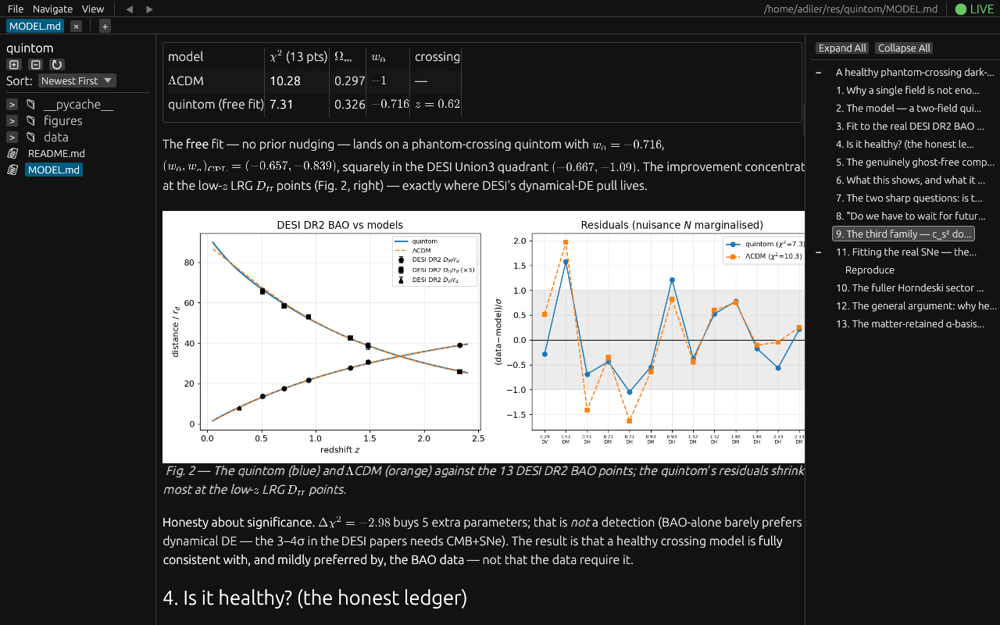
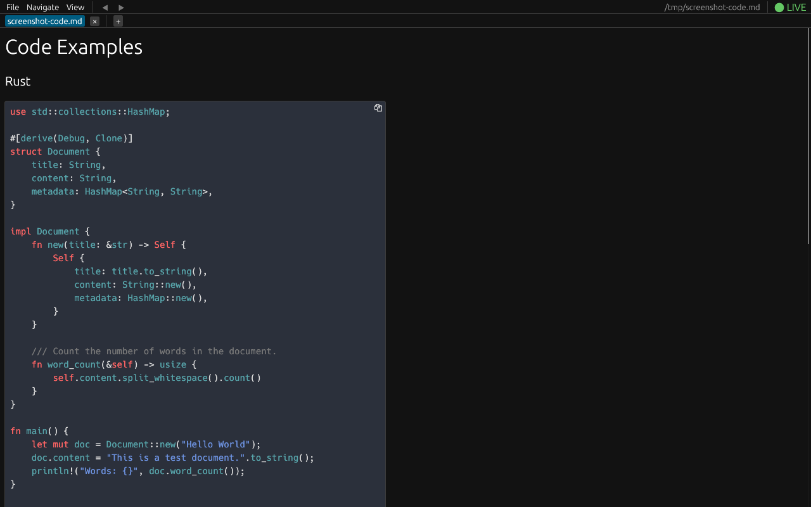
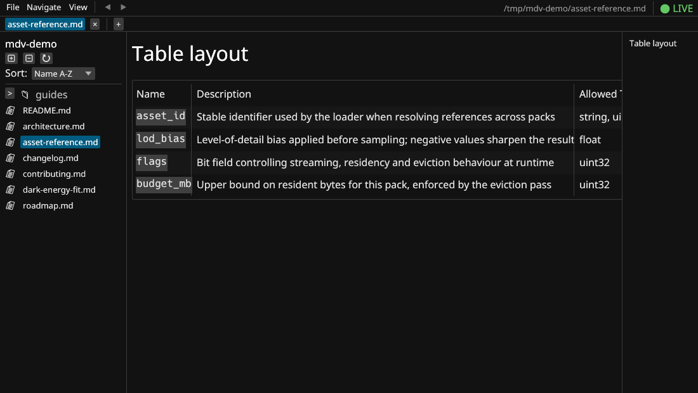
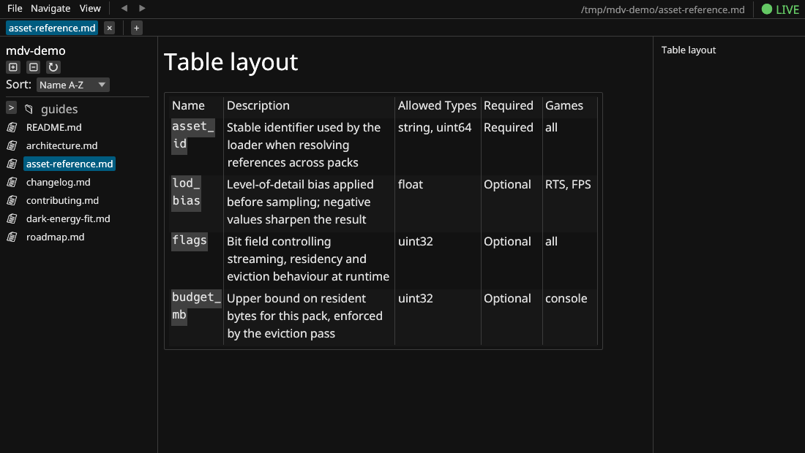
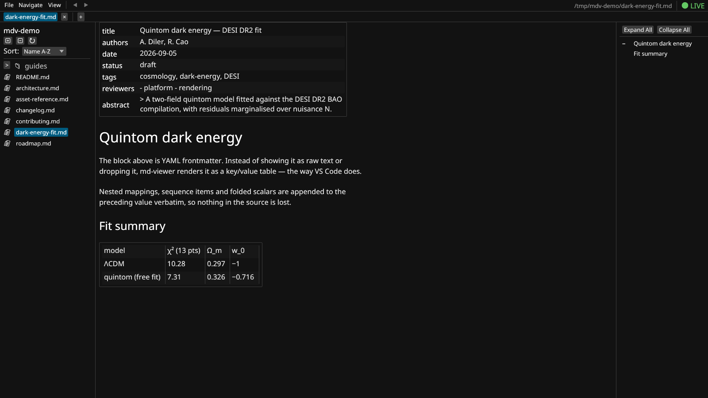
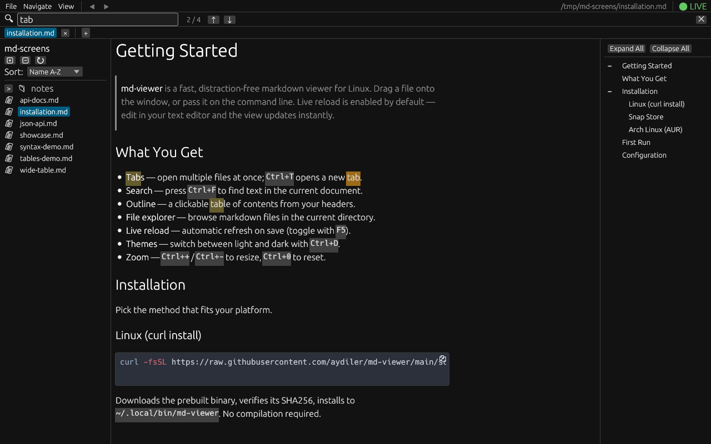
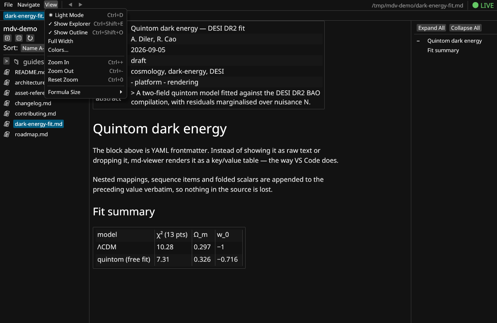
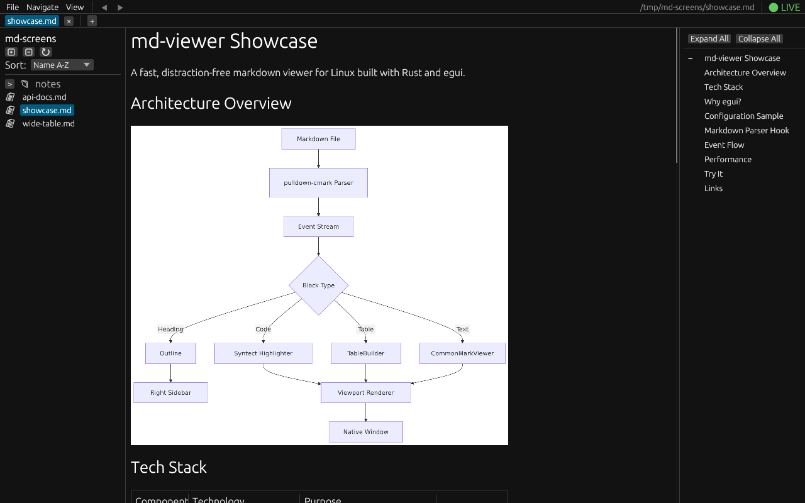
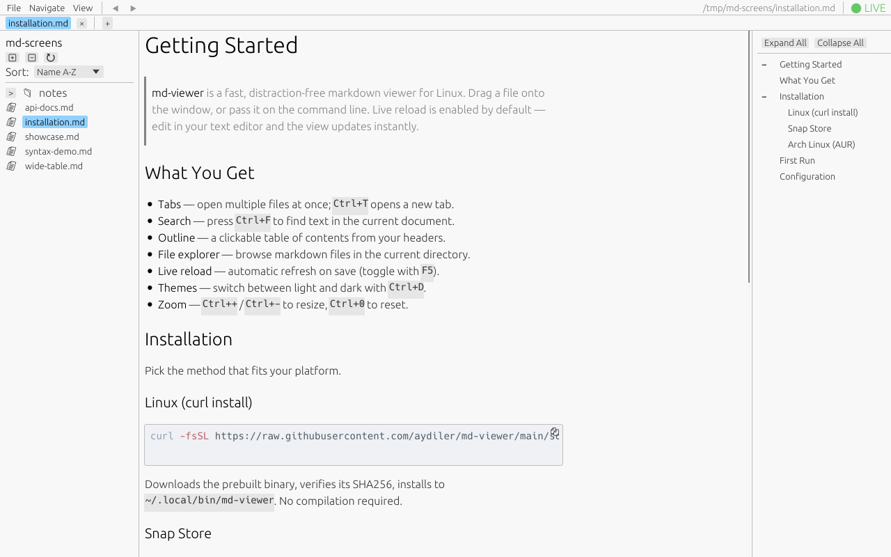

# md-viewer

[](https://crates.io/crates/md-viewer)
[](https://aur.archlinux.org/packages/md-viewer-git)
[](https://snapcraft.io/md-viewer)
[](https://opensource.org/licenses/MIT)
[](https://github.com/aydiler/md-viewer/stargazers)

A fast, lightweight markdown viewer for Linux built with Rust and egui. Designed for distraction-free reading with excellent typography, syntax highlighting, and LaTeX math — from quick notes to scientific papers.



## Features

### Rendering
- **GitHub Flavored Markdown** - Full GFM support including tables, task lists, footnotes, and recognized emoji shortcodes such as `:pushpin:`
- **LaTeX Math** - Inline `$…$` and display `$$…$$` equations rendered via typst + mitex — fractions, sub/superscripts, `\boxed`, accents, matrices, and more — sized and baseline-aligned to the surrounding text
- **Syntax Highlighting** - 200+ languages via syntect with beautiful color schemes
- **Mermaid Diagrams** - Flowcharts, sequence diagrams, and more rendered natively via [merman](https://github.com/Latias94/merman) (click to enlarge)
- **Tables that fit their content** - Column widths follow what each column actually needs, cell text wraps instead of clipping, and widths are optimized so rows wrap less; drag the dividers to override
- **HTML Tables** - Rendered as formatted grids with proper cell padding
- **YAML Frontmatter** - A leading `---` block renders as a key/value table instead of raw text
- **Images & SVG** - Embedded and remote image support (PNG, JPEG, GIF, SVG, HTTP URLs)
- **Unicode Support** - System font fallbacks (Noto, DejaVu) for emojis, CJK, and non-Latin scripts
- **60 FPS Rendering** - Viewport virtualization keeps scroll smooth on 100k+ line docs
- **Typography** - 1.5x line height for optimal readability (WCAG 2.1 compliant)

*200+ languages via syntect, and mermaid diagrams rendered natively*



*Wide tables, same document and same window width. Before, three of five columns sat outside the pane behind a horizontal scrollbar; now every column fits and long cell text wraps instead of being clipped*

| v0.1.17 | 0.2.0 |
|---|---|
|  |  |

*A leading `---` block renders as a key/value table rather than raw text; nested items and folded scalars keep their source spelling*



### Navigation
- **Tab System** - Open multiple documents with tab bar (Ctrl+Click links to open in new tab)
- **In-Document Search (Ctrl+F)** - Find bar with inline highlights, Enter/Shift+Enter to cycle matches
- **File Explorer** - Hierarchical sidebar with lazy-loading directories and sorting options; freely resizable, width remembered
- **Open Folder** - Use File → Open Folder… to choose and persist the file explorer root
- **Outline Sidebar** - Click-to-navigate table of contents from document headers; freely resizable, width remembered
- **Navigation Buttons** - Back/forward buttons in title bar for quick history navigation
- **Per-Tab History** - Independent back/forward navigation within each tab (Alt+Left/Right)
- **Internal Links** - Navigate between markdown files with relative links

*Find bar with inline highlights and a match counter; Enter and Shift+Enter cycle*



### View
- **Dark & Light Themes** - Toggle with Ctrl+D
- **Zoom** - 50% to 300% zoom (Ctrl++/-/0 or Ctrl+Scroll)
- **Full Width** - Toggle between the reading-width column and the full content pane; prose and tables follow it together
- **Formula Size** - Scale rendered math from 100% to 150% (View → Formula Size), independent of UI zoom
- **Keyboard Scrolling** - Scroll documents with ↑/↓ by line or Page Up/Page Down by page when the find bar is closed
- **Live Reload** - Auto-refresh on file changes (enabled by default)
- **Custom Colors** - Customize highlight and link text colors (View → Colors…)

*Full Width, Formula Size and the colour picker all live in the View menu*



*The same document on both themes — syntax highlighting, mermaid diagrams and both sidebars*

| Dark | Light |
|---|---|
|  |  |

### Usability
- **Drag and Drop** - Drop markdown files onto the window to open
- **Native Dialogs** - System file and folder picker integration
- **Welcome Page & Recent Files** - Open files or folders from the idle screen and reopen recent documents
- **Session Persistence** - Remembers open tabs, theme, zoom, and sidebar state
- **Cross-Platform** - Works on X11 and Wayland

## Keyboard Shortcuts

### Tab Management

| Shortcut | Action |
|----------|--------|
| Ctrl+T | Open file in new tab |
| Ctrl+W | Close current tab |
| Ctrl+Tab | Next tab |
| Ctrl+Shift+Tab | Previous tab |
| Ctrl+1-9 | Switch to tab 1-9 |

### Navigation

| Shortcut | Action |
|----------|--------|
| Ctrl+O | Open file in new tab |
| Alt+Left | Navigate back in history |
| Alt+Right | Navigate forward in history |
| Click link | Navigate in current tab |
| Ctrl+Click link | Open link in new tab |

### Search

| Shortcut | Action |
|----------|--------|
| Ctrl+F | Open find bar (or refocus if already open) |
| Enter / ↓ | Jump to next match |
| Shift+Enter / ↑ | Jump to previous match |
| Esc | Close find bar and clear highlights |

### View

| Shortcut | Action |
|----------|--------|
| Ctrl+D | Toggle dark/light mode |
| Ctrl+Shift+E | Toggle file explorer |
| Ctrl+Shift+O | Toggle outline sidebar |
| Ctrl++ / Ctrl+= | Zoom in |
| Ctrl+- | Zoom out |
| Ctrl+0 | Reset zoom to 100% |
| ↑ / ↓ (when find bar is closed) | Scroll document up/down by line |
| Page Up / Page Down | Scroll document up/down by page |
| Ctrl+Scroll | Zoom with mouse wheel |
| Shift+Scroll over a wide table | Scroll the table horizontally |

### File Operations

| Shortcut | Action |
|----------|--------|
| F5 | Toggle file watching |
| Ctrl+Q | Quit application |

## Installation

### Quick Install (Linux / macOS) — recommended

Downloads the prebuilt binary for your platform, verifies its SHA256, and installs the binary to `~/.local/bin` plus bundled third-party notices under `~/.local/share/licenses/md-viewer`. No compilation, takes seconds.

```bash
curl -fsSL https://raw.githubusercontent.com/aydiler/md-viewer/main/scripts/install.sh | sh
```

Supports Linux x86_64 and macOS arm64 (Apple Silicon). Set `INSTALL_DIR=/usr/local/bin` to install elsewhere. Intel Macs need to build from source via `cargo install md-viewer`.

On Linux, **Open File** and **Open Folder** need either a working XDG Desktop
Portal FileChooser (plus the `gdbus` command used to detect it), or Python 3
with Tkinter for the fallback dialog. You can check the fallback with
`python3 -c 'import tkinter'`. Common Tkinter package names are `python3-tk` on
Debian/Ubuntu, `python3-tkinter` on Fedora/RHEL, and `python` plus `tk` on Arch.

> **macOS Gatekeeper note:** binaries are not yet signed/notarized. If macOS refuses to run the app, run:
> `xattr -d com.apple.quarantine ~/.local/bin/md-viewer`

### Snap Store

```bash
sudo snap install md-viewer
```

Auto-updates via snapd.

### Arch Linux (AUR)

```bash
yay -S md-viewer-git    # or: paru -S md-viewer-git
```

Builds from the latest `main` commit (rolling) — your system update grabs new versions automatically.

### Flatpak / Flathub

Once published to Flathub:

```bash
flatpak install flathub io.github.aydiler.md-viewer
```

(Flathub submission in progress — see `flatpak/` and `PUBLISHING.md`.)

### Windows

Download `md-viewer-<version>-windows-x86_64.zip` from the [latest release](https://github.com/aydiler/md-viewer/releases/latest), extract `md-viewer.exe`, and run it. Verify the included `.sha256` if you'd like.

### Cargo (crates.io) — slower, builds from source

```bash
cargo install md-viewer
```

Compiles locally (~2–3 minutes). Update with `cargo install --force md-viewer`. Requires the system dependencies listed below.

### From Source

```bash
git clone https://github.com/aydiler/md-viewer
cd md-viewer
cargo build --release
make install     # installs to ~/.local/bin (optional)
make uninstall   # removes the local installation
```

### System Dependencies (Arch Linux)

Only needed for `cargo install` / building from source:

```bash
sudo pacman -S --needed \
    base-devel clang pkg-config \
    libxcb libxkbcommon openssl \
    gtk3 fontconfig dbus zenity \
    xdg-desktop-portal xdg-desktop-portal-gtk \
    python tk
```

## Usage

```bash
# Open a file and return the terminal prompt (live reload is enabled by default)
md-viewer README.md

# Keep the viewer attached to the terminal for debugging/logs
md-viewer --foreground README.md

# Disable live reload
md-viewer README.md --no-watch
```

Run `md-viewer` with no file to start on the welcome page, then choose Open File, Open Folder, or a recent document. Opening a file always creates or focuses its tab; use the `+` button, File → Open File in New Tab…, Ctrl+T, or Ctrl+O. Use File → Open Folder… to choose the file explorer root.

When launched from a terminal, `md-viewer` detaches by default so the shell prompt is available while the window stays open. Use `--foreground` when you want terminal logs or blocking process behavior.

## Technical Details

- **Binary size**: ~35 MB (includes syntax highlighting, mermaid renderer, math rendering, image support, X11+Wayland). ~7 MB as snap.
- **Startup time**: < 200ms
- **Rendering**: 60 FPS with viewport-based clipping
- **Memory**: Uses mimalloc for improved allocation performance
- **Platform**: Linux (X11 and Wayland via glow backend)

### Built With

- [eframe/egui](https://github.com/emilk/egui) - Immediate mode GUI framework
- [egui_commonmark](https://github.com/lampsitter/egui_commonmark) - Markdown rendering (vendored fork with typography, math, and alignment improvements)
- [emojis](https://crates.io/crates/emojis) - GitHub/gemoji shortcode lookup data (`(MIT OR Apache-2.0) AND Unicode-3.0`; see `THIRD_PARTY_NOTICES`)
- [typst](https://github.com/typst/typst) + [mitex](https://github.com/mitex-rs/mitex) - LaTeX math rendering (LaTeX → typst → rasterized inline)
- [merman](https://github.com/Latias94/merman) - Mermaid diagram rendering
- [syntect](https://github.com/trishume/syntect) - Syntax highlighting
- [notify](https://github.com/notify-rs/notify) - File watching
- [rfd](https://github.com/PolyMeilex/rfd) - Native file dialogs

## License

MIT
